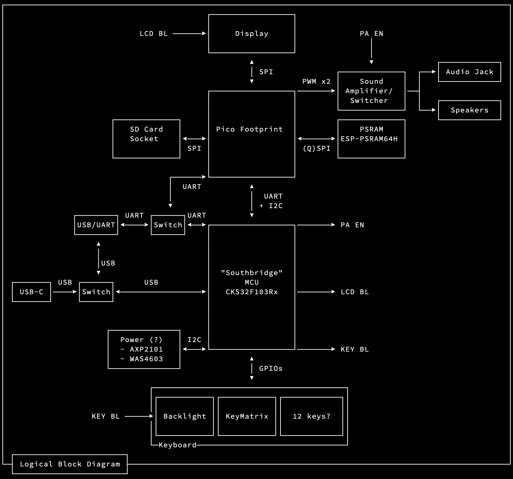

# calc-riff

James' Q2 2025 explorations of the pico calc

## Block Diagram

## Pico Header Pin Mapping

| Pico Pin #    | RP2040 Pad Name   | PicoCalc Net  | Group         | Expansion?    | Note                      |
| :---          | :---              | :---          | :---          | :---          | :---                      |
| 01            | GPIO00            | UART0_TX      | USB DBG UART  | J702-3        | TOP LEFT, USB SIDE        |
| 02            | GPIO01            | UART0_RX      | USB DBG UART  | J702-2        |                           |
| 03            | GND               | GND           | -             | -             |                           |
| 04            | GPIO02            | RAM_TX        | PSRAM         | J703-2        | SPI0                      |
| 05            | GPIO03            | RAM_RX        | PSRAM         | J703-3        | SPI0                      |
| 06            | GPIO04            | RAM_I02       | PSRAM         | J703-4        | SPI0                      |
| 07            | GPIO05            | RAM_IO3       | PSRAM         | J703-5        | SPI0                      |
| 08            | GND               | GND           | -             | -             |                           |
| 09            | GPIO06            | I2C1_SDA      | SOUTHBRIDGE   | -             | I2C1                      |
| 10            | GPIO07            | I2C1_SCL      | SOUTHBRIDGE   | -             | I2C1                      |
| 11            | GPIO08            | UART1_TX      | SOUTHBRIDGE   | -             | UART1                     |
| 12            | GPIO09            | UART1_RX      | SOUTHBRIDGE   | -             | UART1                     |
| 13            | GND               | GND           | -             | -             |                           |
| 14            | GPIO10            | SPI1_SCK      | LCD           | -             | SPI1                      |
| 15            | GPIO11            | SPI1_TX       | LCD           | -             | SPI1                      |
| 16            | GPIO12            | SPI1_RX       | LCD           | -             | SPI1                      |
| 17            | GPIO13            | SPI1_CS       | LCD           | -             | SPI1                      |
| 18            | GND               | GND           | -             | -             |                           |
| 19            | GPIO14            | LCD_DC        | LCD           | -             |                           |
| 20            | GPIO15            | LCD_RST       | LCD           | -             | BOTTOM LEFT, SWD SIDE     |
| 21            | GPIO16            | SPI0_RX       | SDCARD        | -             | BOTTOM RIGHT, SWD SIDE    |
| 22            | GPIO17            | SPI0_CS       | SDCARD        | -             | SPI0                      |
| 23            | GND               | GND           | -             | -             |                           |
| 24            | GPIO18            | SPI0_SCK      | SDCARD        | -             | SPI0                      |
| 25            | GPIO19            | SPI0_TX       | SDCARD        | -             | SPI0                      |
| 26            | GPIO20            | RAM_CS        | PSRAM         | -             | SPI0                      |
| 27            | GPIO21            | RAM_SCK       | PSRAM         | J703-6        | SPI0                      |
| 28            | GND               | GND           | -             | -             |                           |
| 29            | GPIO22            | SD_DET        | SDCARD        | -             |                           |
| 30            | RUN               | RUN           | -             | -             |                           |
| 31            | GPIO26/A0         | PWM_L         | SOUND         | -             | PWM5A                     |
| 32            | GPIO27/A1         | PWM_R         | SOUND         | -             | PWM5B                     |
| 33            | ADC GND           | AGND          | -             | -             |                           |
| 34            | GPIO28/A2         | GP28          | NONE          | J703-7        |                           |
| 35            | ADC VRef          | ADC_VREF      | -             | -             |                           |
| 36            | 3v3 Out           | 3V3_OUT       | -             | -             |                           |
| 37            | 3v3 En            | 3V3_EN        | -             | -             |                           |
| 38            | GND               | GND           | -             | -             |                           |
| 39            | VSYS 5v0          | PICO_VSYS     | -             | -             |                           |
| 40            | VBUS 5v0          | VBUS          | -             | -             | TOP RIGHT, USB SIDE       |

## Keyboard Interface

It uses I2C, I have no idea what the protocol is yet. I need to find their docs or look through their arduino firmware

Some kind of defines:

- https://github.com/clockworkpi/PicoCalc/blob/ebdc77ad4a78b291b7b34be3d334f90fee3dddf3/Code/picocalc_kbd_tester/keyboard_define.h

Rough functional code here?

- https://github.com/clockworkpi/PicoCalc/blob/master/Code/pico_multi_booter/picomite/picocalc/i2ckbd.c

Update: I have some keyboard stuff [working here](./jigs/poststation-rp2040/app/src/main.rs).

## Display Interface

It's some kind of SPI display?

They have the ST7365P doc in their repo: https://github.com/clockworkpi/PicoCalc/blob/master/ST7365P_SPEC_V1.0.pdf

But their LVGL demo has an ILI9488 thing copied into it? https://github.com/clockworkpi/PicoCalc/tree/master/Code/picocalc_lvgl_graphics_demo

It's a 320x320, 16-bit? display

The picomite patch has a lot of interesting information: https://github.com/clockworkpi/PicoCalc/blob/ebdc77ad4a78b291b7b34be3d334f90fee3dddf3/Code/PicoMite/PicoMite.patch#L937

It claims the display type is ILI9488, has some pin mapping, and what appears to be a bunch of I2C and Display setup/operation commands

It also seems to configure the I2C speed to 10khz ??? - https://github.com/clockworkpi/PicoCalc/blob/ebdc77ad4a78b291b7b34be3d334f90fee3dddf3/Code/PicoMite/PicoMite.patch#L976
